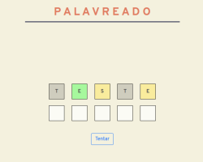

# TOME PALAVRA!
### _Uma versão PT-BR não-oficial do jogo [Wordle](https://www.powerlanguage.co.uk/wordle/)_
> [Jogue agora mesmo / Play it right now](https://jotavkf.github.io/tomepalavra/)

# PT
## Sobre o projeto

Tome palavra! foi concebido como primeiro projeto para o bootcamp em Web Development da Ironhack/BR. A ideia de refazer Wordle foi intuitiva, dado que já acompanhava o crescimento do jogo desde o seu lançamento, somada ao fato de que as versões disponíveis em português demandam uma janela de tempo "chata" entre uma tentativa e a outra. Assim, quis me desafiar a produzir o jogo com os conhecimentos adquiridos até aqui - HTML / CSS / Vanilla JS.

## Como funciona o jogo

A ideia de Tome palavra! é simples: o jogo, ao iniciar, define uma palavra que deve ser adivinhada. A rodada é composta por 6 tentativas, em que o jogador deve inserir as letras de uma palavra nos campos designados e clicar em "Tentar!" (ou Enter) para ter um retorno do jogo. Os retornos visuais possíveis até a quinta rodada são: i) verde se a letra existe na palavra do jogo e está no lugar certo; ii) amarelo se a letra existe na palavra mas está no lugar errado; iii) cinza se a letra não existe na palavra. Se o jogador acertar a palavra, ele receberá um retorno em forma de alerta com "Parabéns!". Se, ao chegar na 6a rodada, o jogador ainda assim não conseguir adivinhar a palavra, ele receberá um alerta informando a derrota e reiniciando o jogo com uma nova palavra/rodada.

## Como o código foi feito

O código foi segmentado entre uma seção OOP para a criação das regras do jogo, uma database simples de palavras e um script principal, responsável por manipular o DOM e avançar nas tentativas do jogo. 

# EN
## About the project

Tome palavra! was conceived as my first project for the Web Development bootcamp at Ironhack/BR. The idea of recreate Wordle was intuitive, given that I already was following the game's growth since its releasement, added to the fact that different versions of the game available in Portuguese demand a "boring" window of time between a try and another. Hence, I wanted to challenge myself to develop the game with the knowledge achieved so far in the course - HTML / CSS / Vanilla JS.

## How the game works

The idea behind of Tome palavra! is simple: the game, during launch, defines a word that must be guessed. The round is composed by 6 tries, as in each one the player must insert the letters of a word in the assigned fields and click on "Tentar!" (or press Enter) to get a return from the game. The possible visual returns until the fifth round are: i) green if the letter exists in the word of the game and is in the right place; ii) yellow if the letter exists in the word of the game but is in the wrong place; iii) grey if the letter doesn´t exists in the word of the game. If the player suceeds in guessing the word, he'll receive a return from the game in form of an alert with "Congratulations!". If, arriving in the sitxh round, the player still doesn´t get to guess the right word, he'll receiva an alert informing the defeat and restarting the game with a new word/round.

## How the code was done

The code was segmented between an OOP section for developing the rules of the game, a simple database of words and a main script, responsible for manipulate the DOM and advance in the tries of the game. 
